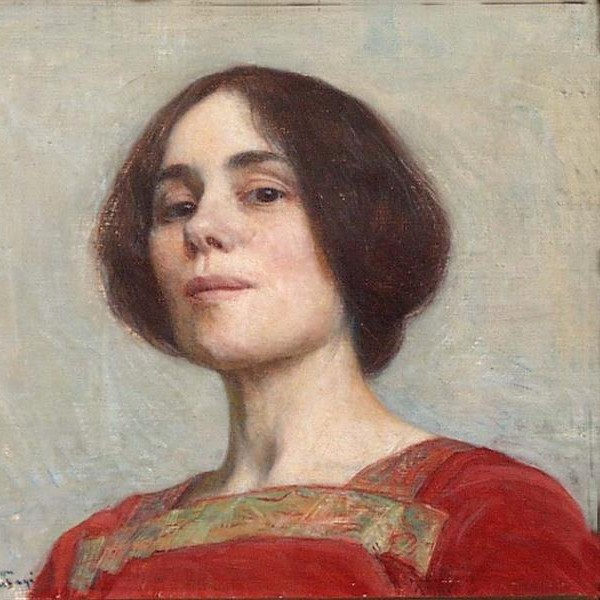
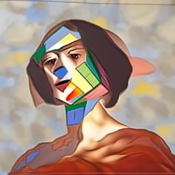
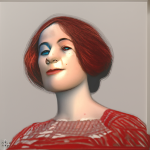

# Text Guided Style Transfer

This is my attempt at implementing [Zero-Shot Contrastive Loss for Text-Guided Diffusion Image Style Transfer ](https://arxiv.org/abs/2303.08622).

## Motivation

I got interested in the possibility of manipulating pretrained text2img models for video edition. I googled _CLIP-based Style Transfer_ and I stumbled upon this paper, which didn't have an open implementation so I decided to do it myself.

## Setup project

Clone submodules:

```
git clone https://github.com/openai/CLIP
git clone https://github.com/ouhenio/guided-diffusion.git
```

Install submodules dependencies:

```console
pip install -e ./CLIP & pip install -e ./guided-diffusion
```

Download the unconditional diffusion model (weights 2.06GB):

```console
wget -O unconditional_diffusion.pt https://openaipublic.blob.core.windows.net/diffusion/jul-2021/256x256_diffusion_uncond.pt
```

## Usage

Sadly, the usage interface is pretty lacking.


```console
python main.py
```

To try different styles, hyperparams and image edit these lines in `main.py`:

```
139: guidance prompt
216: loss hyperparams
155: initial image
```

## Example Results

| Image                   |                            Prompt | Global Loss | Directional Loss | Feature Loss | MSE Loss | ZeCon Loss |
|-------------------------|----------------------------------:|------------:|------------------|--------------|----------|------------|
|            |                          portrait |        None | None             | None         | None     | None       |
|  |                            cubism |       20000 | 15000            | 50           | 3000     | 10         |
|   |   3d render in the style of Pixar |        5000 | 5000             | 100          | 10000    | 500        |


## Final thoughts

I've found that this method kinda works but it is **very sensitive to hyperparams**, which makes it frustrating to use.

Table 5 of the paper makes me confident that the authors had the same issue.